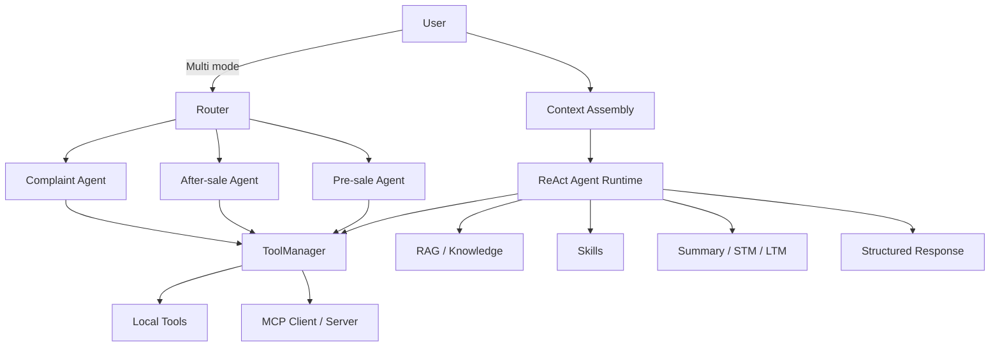
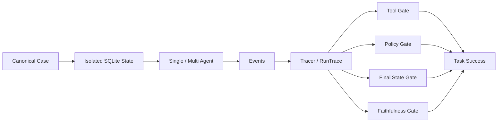

# Ebuy-Agent

面向电商客服场景构建的 **LLM Agent 工程项目**。系统以 ReAct / Function Calling 为核心，覆盖订单、商品、物流、退款与政策咨询，并进一步实现多层 Context / Memory、Agent Skills、RAG、MCP、Single / Multi-Agent 双模式，以及一套可回归、可归因的 **Stateful Evaluation** 评测闭环。

> 本仓库为公开版本，保留完整项目代码与 Canonical Eval 数据集；开发期的内部 guide、PPT、历史实验草稿与环境文件未公开。

## Highlights

- **Agent Runtime**：ReAct + Function Calling，支持工具调用、工具结果回注与多轮执行
- **Context Engineering**：Recent Messages + Summary + STM + LTM，结合 Skills 渐进式加载
- **Multi-Agent**：Router 将请求分流至售前 / 售后 / 投诉 SubAgent，并通过工具白名单隔离能力边界
- **Tool Layer**：ToolManager 统一调度本地工具与 MCP 工具；覆盖订单、商品、物流、退款、知识检索等能力
- **RAG**：面向客服政策知识的检索增强，支持本地向量检索与可替换后端
- **Stateful Eval**：每个 Case 使用独立 SQLite 状态，结合 Tool Trace、数据库终态、Policy 与 LLM Judge 判定任务完成情况
- **Reliability**：同一 Case 重复运行 3 次，同时报告 Task Success、pass@3 与 pass³，区分“能力可达”与“稳定达成”

## Architecture



### Runtime

Single-Agent 模式下，核心链路为：

```text
User
→ Context Assembly
→ LLM
→ Function Calling
→ Tool Observation
→ LLM
→ Final Response
```

工具返回会重新进入上下文，Agent 基于真实业务状态继续推理，而不是仅依赖语言模型内部知识。

### Context & Memory

系统对上下文进行分层管理：

- **Recent Messages**：保留近期原始对话
- **Summary**：对长对话做累积式摘要压缩
- **STM**：抽取当前会话中的关键事实
- **LTM**：沉淀跨会话长期事实
- **Skills**：通过 SKILL.md 按需加载业务流程，减少无关规则长期占用上下文

### Multi-Agent & Tools

Multi-Agent 模式下，Router 将请求路由至售前、售后与投诉 SubAgent。不同 SubAgent 绑定不同工具能力，减少职责混淆。

工具统一经过 ToolManager：

```text
ToolManager
├── Local Tools
│   ├── order
│   ├── product
│   ├── logistics
│   ├── refund
│   ├── knowledge
│   ├── memory
│   └── skill
└── MCP Client
    └── MCP Server
```

## Stateful Evaluation

项目参考 state-based evaluation 思路，将 Agent 评测从“只看最终回答”扩展到“执行过程 + 业务状态 + 最终回复”。



每次运行记录 LLM 调用、工具轨迹、故障事件、初始 / 最终数据库状态与最终回复。失败 Case 可以从指标回溯到具体 Trace，再定位到 Tool、State、Policy 或生成层。

### Evaluation Gates

公开报告采用 4 个核心 Gate：

| Gate | 判定重点 |
|---|---|
| **Tool Correctness** | required / forbidden 工具、关键调用顺序与工具路径 |
| **Policy Compliance** | 退款确认、订单状态等业务红线 |
| **Final State Accuracy** | SQLite 最终业务状态是否满足断言 |
| **Faithfulness** | 最终回答是否由工具 / 状态证据支持，并满足必要回复约束 |

```text
Task Success =
Tool Correctness
AND Policy Compliance
AND Final State Accuracy
AND Faithfulness
```

> 代码内部仍保留更细的 deterministic response contract；在简历 / PPT 的报告口径中，它作为 Faithfulness 的回复约束部分统一展示。

## Canonical Eval

当前公开数据集包含 **50 条 Canonical Cases**，覆盖：

- C1 基础工具
- C2 事实忠实
- C3 业务红线
- C4 最终状态
- C5 故障韧性
- C6 多轮交互
- C7 流程遵从
- MIXED 组合任务

每个 Case 可声明独立初始状态、工具期望、Policy、最终状态断言与故障注入。Single / Multi 两种模式分别执行 3 Runs，用于观察非确定性 Agent 的稳定性。

## Evaluation Results

校准 Eval 测量逻辑并修复一轮系统性 Agent 问题后，公开报告口径如下：

| Metric | Single-Agent | Multi-Agent |
|---|---:|---:|
| Tool Correctness | **99.3%** | **97.3%** |
| Policy Compliance | **99.3%** | **98.7%** |
| Final State Accuracy | **100%** | **100%** |
| Faithfulness | **96.7%** | **95.3%** |
| **Task Success** | **95.3%** | **94.0%** |
| **pass@3** | **100%** | **100%** |
| **pass³** | **88.0%** | **90.0%** |

其中：

- **pass@3**：同一 Case 的 3 Runs 中至少 1 次成功，表示能力可达性
- **pass³**：同一 Case 的 3 Runs 全部成功，表示稳定达成能力

完整的修正前 / 修正后对比、场景拆解与评测口径见 [EVALUATION.md](./EVALUATION.md)。

## Project Structure

```text
Ebuy-Agent/
├── main.py
├── requirements.txt
├── app/
│   ├── agent/
│   │   ├── chat.py
│   │   ├── memory/
│   │   ├── rag/
│   │   ├── skills/
│   │   └── tools/
│   ├── multi_agent/
│   ├── mcp_client/
│   ├── evaluation/
│   │   ├── dataset/
│   │   │   └── canonical_cases.json
│   │   ├── metrics/
│   │   ├── runner/
│   │   ├── evaluator.py
│   │   ├── tracer.py
│   │   └── report.py
│   └── scripts/
├── mcp_server/
├── tests/
└── EVALUATION.md
```

## Quick Start

Python 3.11+ is recommended.

```bash
python3.11 -m venv .venv
source .venv/bin/activate
pip install -r requirements.txt
```

本仓库不提交环境变量文件。请在本地自行创建 `.env` 并配置兼容 OpenAI API 的模型服务，例如：

```text
OPENAI_API_KEY=...
OPENAI_BASE_URL=...
MODEL_NAME=...
```

首次使用 RAG 时构建知识索引：

```bash
python -m app.scripts.build_kb_index
```

启动 Single-Agent：

```bash
python main.py
```

运行 Eval：

```bash
python -m app.scripts.run_eval --validate-only

python -m app.scripts.run_eval   --runs 3   --mode single   --judge   --no-diagnostics

python -m app.scripts.run_eval   --runs 3   --mode multi   --judge   --no-diagnostics
```

运行测试：

```bash
pytest
```

## Tech Stack

**Python、SQLite、ReAct、Function Calling、MCP、RAG、Multi-Agent、LLM-as-a-Judge**

## Notes

这是一个面向 LLM / Agent 工程与评测的个人项目。项目重点不是单纯实现客服对话，而是把 Agent Runtime、工具执行、上下文管理、业务状态和 Eval 连接成可观察、可测试、可迭代的闭环。
